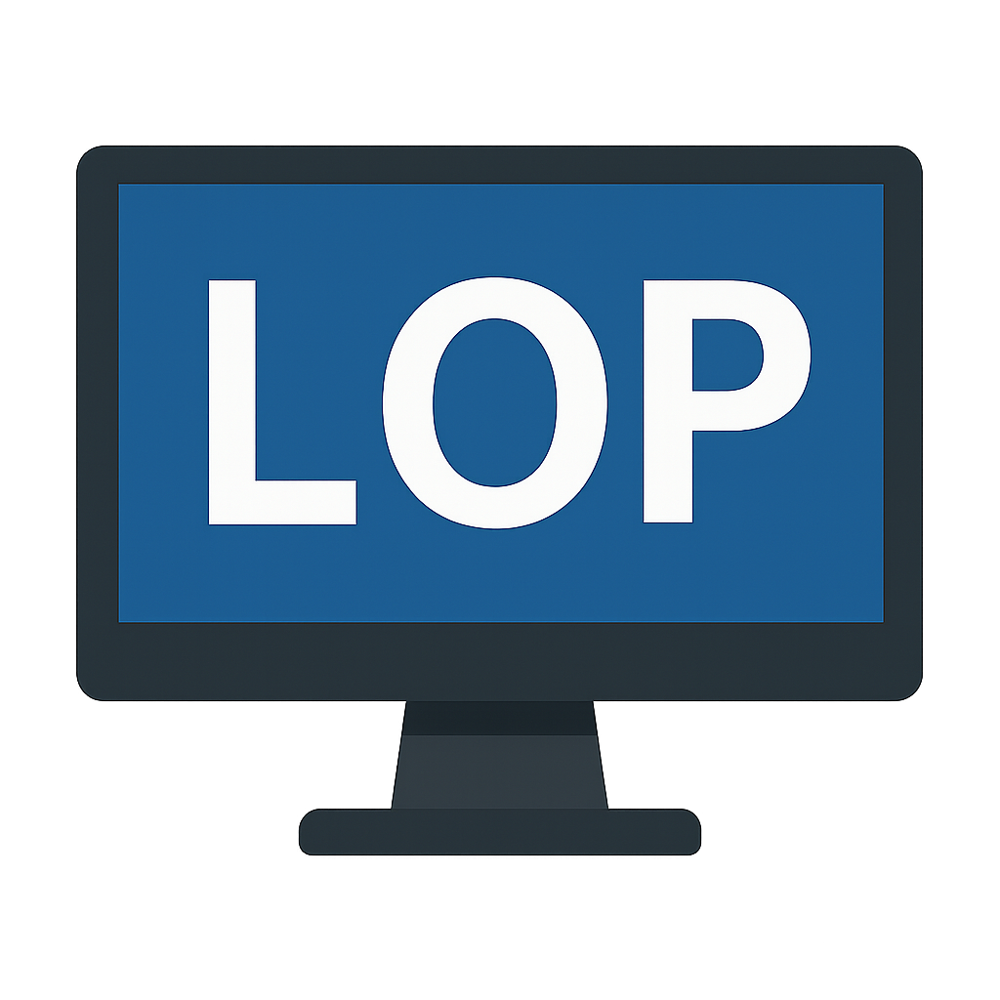
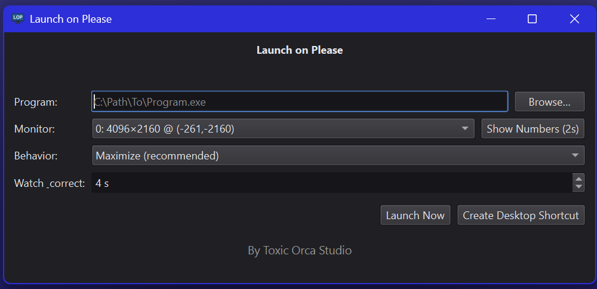

# Launch on Please

<p align="center">
  
</p>

 **Launch on Please (LOP)** is a free Windows utility that lets you launch any program on a specific monitor with your preferred window state (maximize, fit-to-workarea, or normal).  
 
No more dragging windows around every time you open Discord, OBS, or your favorite game — just click and go.

--- 
## 🖼 Screenshot


---

## ✨ Features

- 🎯 **Choose the monitor**: Launch apps on whichever display you want.
- 🖥️ **Flexible behavior**: Maximize, fit to work area (respects the taskbar), or keep the window’s normal size.
- 🔢 **Overlay helper**: Show numbered overlays on your monitors to make picking the right one easy.
- ⚡ **Auto-correct**: If the program tries to jump back to another monitor, LOP keeps it in place for a few seconds.
- 🔗 **Desktop shortcuts**: Generate one-click shortcuts so you don’t have to open LOP every time.
- 🎨 **Dark mode UI**: Clean, modern interface with a small footprint.
- 🐳 **Free & open-source**: Built by [Toxic Orca Studio](https://github.com/ToxicOrca) and released to the community.

---

## 📦 Installation

Download the latest release from the [Releases page](../../releases) and run the installer or portable `.exe`.

Alternatively, build it yourself:

```bash
git clone https://github.com/YourUsername/launch-on-please.git
cd launch-on-please
pip install -r requirements.txt
pyinstaller --onefile --windowed --icon=LOP.ico launch_on_please.py
```

Requirements:
- Python 3.9+  
- [PySide6](https://pypi.org/project/PySide6/)  
- [pywin32](https://pypi.org/project/pywin32/)  
- [psutil](https://pypi.org/project/psutil/)  

---

## 🛠 Usage

1. Launch **Launch on Please**.  
2. Browse to select the program `.exe` you want.  
3. Pick your monitor (use **Show Numbers** to confirm which is which).  
4. Choose the behavior:
   - **Maximize** – full screen but respecting taskbar  
   - **Fit to work area** – fill the screen without full maximize  
   - **Normal window** – keep the program’s default size  
5. Either:
   - Click **Launch Now** to run immediately, or  
   - Click **Create Desktop Shortcut** to make a one-click shortcut with your chosen settings.  

---

## ⚡ Why "Launch on Please"?

Because sometimes Windows needs a little *please* to do what you want.  
No more guessing, no more dragging — just launch it where you want it.

---

## 📜 License

This project is released under the [MIT License](LICENSE).  
You are free to use, modify, and share it.

---

## 🤝 Contributing

Pull requests are welcome! If you’ve got ideas for improvements, bug fixes, or new features:
- Fork the repo  
- Create a feature branch  
- Submit a PR  

---

## 🙌 Credits

Developed by **Toxic Orca Studio**  
Built with help from [ChatGPT](https://openai.com/chatgpt)

